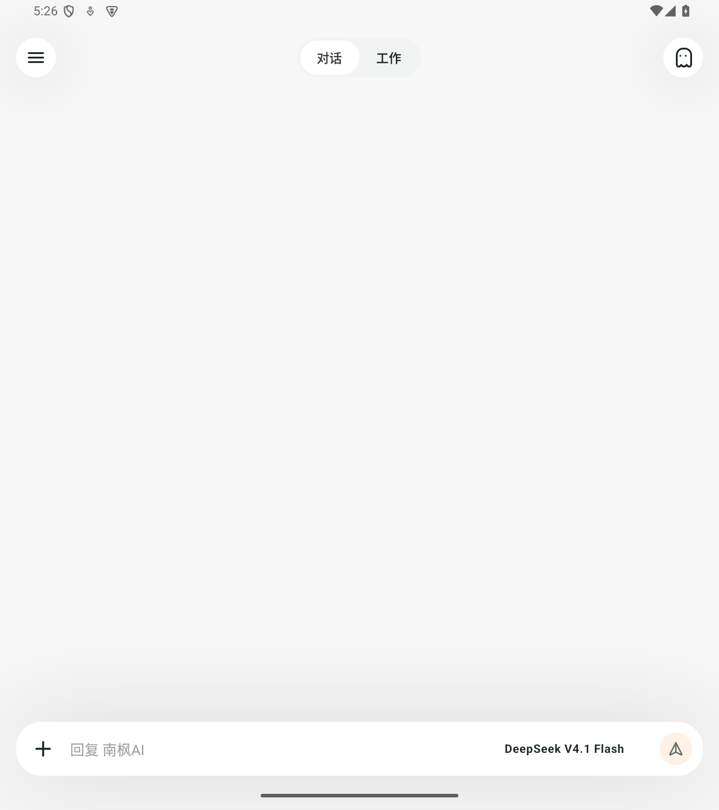
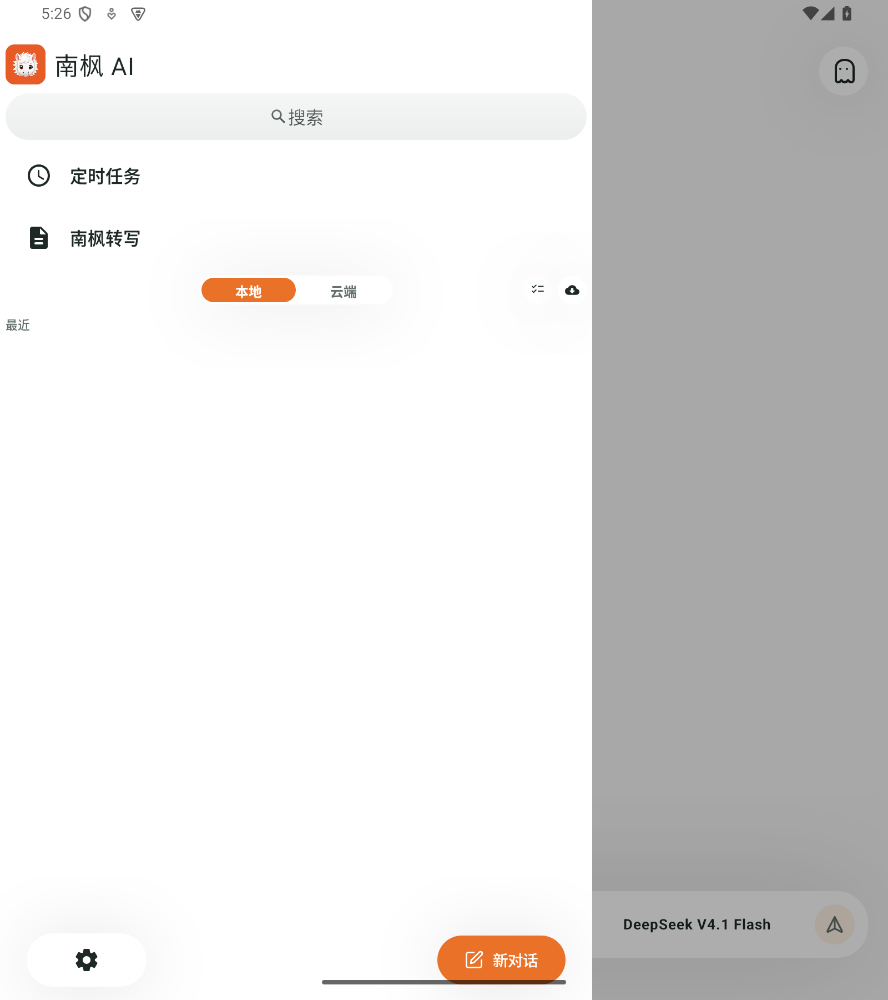

# 南枫 AI

本地优先的个人 AI 工作台：Android、macOS，后续支持 Windows。

## 下载

首个预发布版本：[v2026.09.15-initial](https://github.com/nanzhufeng/Nanfeng-AI/releases/tag/v2026.09.15-initial)

- Android：`0.3.0-p10j` APK
- macOS：`0.6.0-p6d-dev` DMG（Apple Development 签名，未公证）

## 源码

| 目录 | 内容 |
| --- | --- |
| `app/` | Android |
| `desktop/` | macOS 与未来 Windows 共用的桌面端 |
| `protocol/` | 跨端协议 |
| `supabase/`、`upload-gateway/` | 可选云端组件 |

Windows 必须在 Windows 原生环境单独构建、签名和验收；macOS 包不能替代 Windows 包。

## Android 预览

本次候选 APK 在隔离 Android 15 模拟器重新采集。Mac 本轮未截图，避免误拍本机已有数据。

开发规则与当前状态见 [AGENTS.md](AGENTS.md) 和 [当前交接](docs/CURRENT_HANDOFF.md)。
