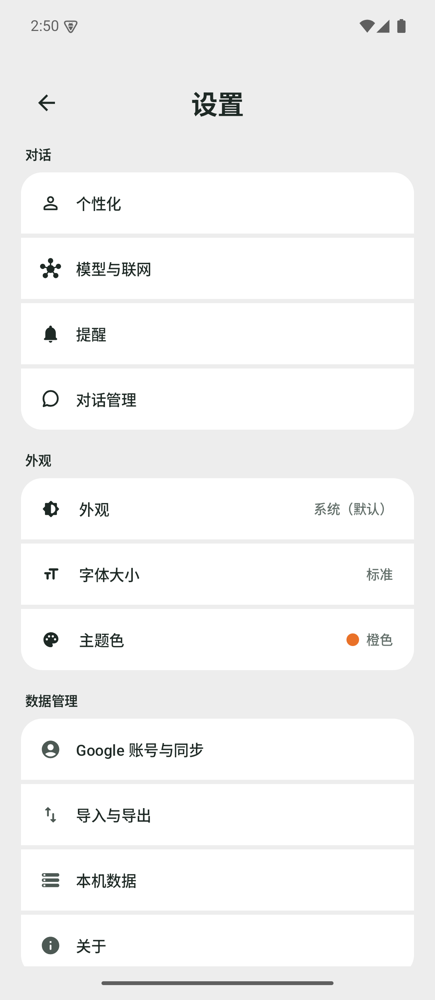
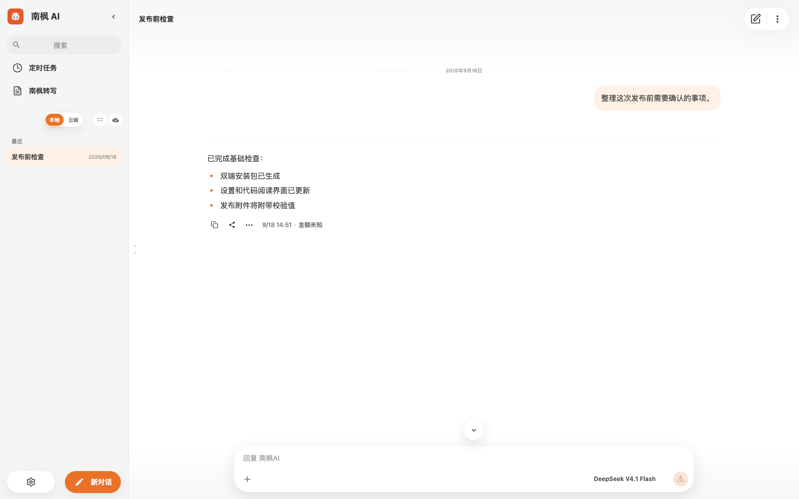

# 南枫 AI

本地优先的个人 AI 工作台，支持 Android 与 macOS。

## 下载

正式版：[v1.0.12](https://github.com/nanzhufeng/Nanfeng-AI/releases/tag/v1.0.12)

- Android：[APK](https://github.com/nanzhufeng/Nanfeng-AI/releases/download/v1.0.12/Nanfeng-AI-Android-1.0.12.apk)
- macOS：[DMG](https://github.com/nanzhufeng/Nanfeng-AI/releases/download/v1.0.12/Nanfeng-AI-macOS-1.0.12.dmg)（Apple Development 签名，未公证）

## 预览

| Android | macOS |
| --- | --- |
|  |  |

Android 图来自隔离模拟器中的 1.0.12 正式 APK；macOS 图来自当前构建的无数据界面。

## 源码

| 目录 | 内容 |
| --- | --- |
| `app/` | Android |
| `desktop/` | macOS 与未来 Windows 共用的桌面端 |
| `protocol/` | 跨端协议 |
| `supabase/`、`upload-gateway/` | 可选云端组件 |

Windows 必须在 Windows 原生环境单独构建、签名和验收；macOS 包不能替代 Windows 包。

开发规则与当前状态见 [AGENTS.md](AGENTS.md) 和 [当前交接](docs/CURRENT_HANDOFF.md)。
