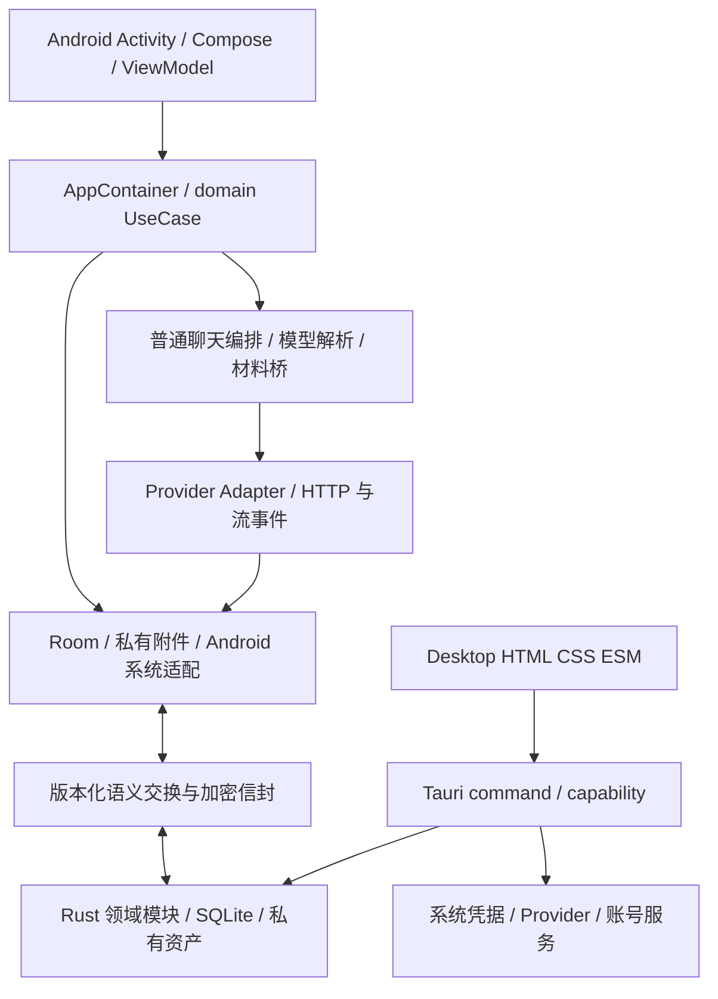

# 南枫 AI 完整开发档案

> 复盘日期：2026-09-10。事实基线：`ef76fc4797e3d86c319ae84bef18ed48e48dd5b3`，业务代码 checkpoint `c4aad94`。范围为整个 Nanfeng_AI 仓库，包括 Android、Desktop、协议、Supabase、附件网关和开发交付工具。本文是架构与过程档案；当前产品行为由领域合同定义，最新执行／产物状态读取 [当前交接](CURRENT_HANDOFF.md)。复盘阶段未修改业务代码、数据库、配置值或测试逻辑；随后经用户授权修复四项边界问题，见[修复记录](review/20260910/BOUNDARY_FIXES.md)。

## 1. 复盘方法与证据范围

全量枚举并读取了 1227 个 Git 跟踪文件的字节，建立路径、大小、文本／二进制分类和 SHA-256 清单；1155 个文本文件做结构、声明、配置和风险关键词扫描，72 个二进制文件只做身份／大小检查，未重新逐图视觉验收。对核心执行、持久化、凭据、迁移、导入、协议与配置入口进行定向语义核查。完整检查本地全部 146 条可达提交的日期、主题和文件变更统计；仓库只有 main、无远端和 tag，不代表远端服务历史已检查。

**范围限制：** 全量结构扫描不等于对每一行历史实现作形式证明，也不等于全部功能端到端验收。忽略的 build／target／dist、运行数据库、凭据及两组未跟踪的历史截图／Playwright 输出不纳入业务源码；不读取用户正文或真实附件。没有运行线上 API、设备部署或数据库迁移。

证据清单见 [全库文件清单](review/20260910/files.json)、[完整 Git 主题及变更统计](review/20260910/history.json)、[复盘验证摘要](review/20260910/verification.json)。清单记录复盘开始时的基线，故不包含本轮随后新增的复盘文档与 Skill 脚本。代码链接指向工作树，历史断言用 commit 固定；网页出现在旧文档中仅是当时资料，不视为本轮外部核验。

## 2. 项目目标与边界

项目将个人对话、附件、知识、记忆、项目和导入历史保存在本机，同时提供明确授权的多 Provider 对话、资料解析与同步能力。Android 承担手机捕获、会话及文件体验；Desktop 提供宽屏工作台和自己的 SQLite／私有附件。两端通过语义协议交换，不能直接共享 Android Room 文件。依据：[组合根](../app/src/main/java/com/nanzhufeng/ai/app/AppContainer.kt)、[Desktop ADR](ADR-002-P6A_DESKTOP_AND_EXCHANGE.md)、[交换合同](NFAI_EXCHANGE_V1_CONTRACT.md)。

普通聊天选择、编辑和预览留在本机；点击发送授权本次材料交给已披露的模型接收方。Direct、Auto、Compare 有不同选择／分支语义，记录实际执行者而非只记界面选项。临时聊天有独立本地生命周期，不能因普通聊天可联网就推断临时聊天也可调用模型。依据：[发送授权](../app/src/main/java/com/nanzhufeng/ai/domain/NormalChatEgressAuthorization.kt)、[运行时上下文合同](ANDROID_RUNTIME_CONTEXT_CURRENT_CONTRACT.md)、[临时聊天领域](../app/src/main/java/com/nanzhufeng/ai/domain/TemporaryConversation.kt)。

“有代码”“本地测试通过”“原生界面验收”“真实服务成功”是四种事实。Windows 原生交付、跨端真实同步、完整账单对账与自主 Agent 均不能从模块名字或历史规划推断为完成。

## 3. 技术栈、配置与目录

| 层 | 当前代码事实 | 依据 |
| --- | --- | --- |
| Android 构建 | 单模块 `:app`；Gradle 9.5.0，AGP 9.3.1，Compose plugin 2.2.10，KSP 2.2.10-2.0.2 | [根构建](../build.gradle.kts)、[模块配置](../settings.gradle.kts)、[wrapper](../gradle/wrapper/gradle-wrapper.properties) |
| Android 平台 | minSdk 26，compile／targetSdk 36；applicationId `com.nanzhufeng.ai`；code 66／0.3.0-p10j；Release 非 Debug、未开启 minify | [App 构建配置](../app/build.gradle.kts) |
| Android UI／后台 | Kotlin、Compose／Material 3、BOM 2026.06.01、Lifecycle 2.10.0、WorkManager 2.10.5；手工组合根，无 Hilt/Koin 配置 | 同上、[Manifest](../app/src/main/AndroidManifest.xml) |
| Android 数据／文件 | Room 2.8.4、Keystore、私有文件、SAF／FileProvider、PDFBox Android 2.0.27.0 | 同上、[私有附件](../app/src/main/java/com/nanzhufeng/ai/data/AndroidPrivateAttachmentStore.kt) |
| Desktop | 原生 HTML/CSS/ESM＋Tauri 2＋Rust 2021；不是 React/Vite 项目；前端构建由自有复制脚本完成 | [package.json](../desktop/package.json)、[构建脚本](../desktop/scripts/build.mjs)、[Cargo](../desktop/src-tauri/Cargo.toml) |
| Desktop 原生 | rusqlite 0.37 bundled、reqwest 0.12／rustls、tokio、serde、ZIP、lopdf、AES-GCM／PBKDF2／zeroize；macOS Security.framework 凭据实现 | [Cargo](../desktop/src-tauri/Cargo.toml)、[lock](../desktop/src-tauri/Cargo.lock) |
| Desktop 包 | Tauri product version 0.6.0-p6d-dev，Cargo／npm 均 0.0.1；当前 targets 为 app，默认 1440×900；CSP 禁止任意前端网络／脚本来源 | [Tauri 配置](../desktop/src-tauri/tauri.conf.json) |
| 云／网关 | Supabase PostgreSQL RPC／RLS＋Deno Edge Function；独立 Go 1.24 网关，Docker 多阶段构建／nonroot 运行 | [SQL](../supabase/migrations/202608130001_p7c_secure_sync.sql)、[头像函数](../supabase/functions/google-avatar/index.ts)、[Go](../upload-gateway/go.mod)、[Dockerfile](../upload-gateway/Dockerfile) |
| 测试 | Android JUnit 4／Robolectric 4.16.1／Room testing／SQLite JDBC；Node 内置 test；Rust cargo test；Go testing | App／Desktop／Go 构建配置及各测试目录 |

以上是仓库声明／锁定值，不是当前官方推荐版本或漏洞审计结果。Android、Desktop 包版本和 SQLite 版本属于不同命名空间，不能互换。

| 目录 | 基线文件数 | 职责与注意事项 |
| --- | ---: | --- |
| `app/` | 680 | 338 个 main 文件、273 个 test 文件、66 份 schema，以及验收变体等；应用、测试、验收包分开读取 |
| `desktop/` | 143 | 37 个前端 src 文件、47 个 Node 测试、27 个 Rust src 文件及构建／权限／图标配置 |
| `protocol/` | 16 | v1／v2 交换与同步格式、schema、golden、严格验证脚本 |
| `supabase/` | 5 | SQL 迁移、头像函数／策略及静态测试；不含本次线上状态 |
| `upload-gateway/` | 5 | 独立临时附件服务、4 个 Go 测试函数、Docker 与说明 |
| `docs/` | 330 | 当前合同、架构决策、阶段计划、审计、交接与历史证据；并非 330 份 Markdown |
| `.agents/` | 10 | 复盘前五类 Skill 与 UI 元数据；本轮扩展双端流程 |
| `scripts/`、`delivery/`、`artwork/` | 11／6／10 | 交付／核验工具、历史交付清单、图标资源；安装包被 Git 忽略 |

根目录没有 README。入口由 AGENTS、当前交接和当前档案承担；本轮不另建一份重复总控正文。

## 4. 架构与所有权

Android `AppContainer` 是手工依赖注入入口；UI 和 ViewModel 请求 UseCase／owner，data 负责 Room、文件与系统能力，ai 负责模型协议与执行，background／WorkManager 负责生命周期较长的任务。普通真实聊天与旧受限 P2 adapter 并存，不能看到一处 Disabled 就断言全应用不联网。[证据：AppContainer](../app/src/main/java/com/nanzhufeng/ai/app/AppContainer.kt)。

Desktop `app.mjs` 负责页面／事件，`lib.rs` 注册 IPC、装配应用状态及大量业务边界，独立 Rust 模块负责设置、普通聊天、备份、同步、提醒等。权限清单、Rust 注册和前端 invoke 必须一致；静态浏览器预览没有等价的私有 SQLite 能力。[证据：前端入口](../desktop/src/app.mjs)、[Rust 入口](../desktop/src-tauri/src/lib.rs)、[permissions](../desktop/src-tauri/permissions/default.toml)、[capability](../desktop/src-tauri/capabilities/default.json)。

### 4.1 数据与迁移

- Android 当前 Room schema 为 66，导出定义有 127 个 entity、0 个 view，schema 1–66 全部在库。65→66 增加发送授权时间和披露版本两个可空字段；旧记录不伪造授权。组合根注册前向迁移，业务语义变化若不改表结构，不应无故增加 schema。[数据库](../app/src/main/java/com/nanzhufeng/ai/data/local/NanfengAiDatabase.kt)、[Schema 66](../app/schemas/com.nanzhufeng.ai.data.local.NanfengAiDatabase/66.json)。
- Desktop 工作区 SQLite 的 `user_version` 迁移上限为 38，与 Android 66 无关；工作区语义 JSON 和独立业务表并存，不能套用一份 Android 表清单去恢复 Desktop。[Store 迁移](../desktop/src-tauri/src/lib.rs)。
- 正文／附件属于授权业务存储；审计／错误／Invocation 只允许所需安全元数据。凭据由 Android Keystore／macOS 凭据 owner 管理，不进入交换包、日志或复制出来的业务备份。[Android 凭据](../app/src/main/java/com/nanzhufeng/ai/data/ModelServiceStorage.kt)、[Desktop 凭据](../desktop/src-tauri/src/desktop_model_service_v1.rs)。
- Desktop 默认根通过 app_data_dir 的 `p6b-workspace` 解析，选定路径配置独立保存在 app_config_dir；显式隔离验收有自己的根。路径迁移有旧目录锁、暂存复制和 SQLite 检查，保留源目录。此机制已有 3 项 owner 测试，未据此宣称真实迁移／断电恢复完整。[路径 owner](../desktop/src-tauri/src/desktop_storage_location.rs)。

## 5. 核心模块与实现边界

| 模块 | 实际实现与责任 | 主要代码证据 |
| --- | --- | --- |
| 会话／消息树 | 消息节点、当前叶、分支、草稿、附件引用、归档／回收站；启动按退出 ID／时间／生成状态恢复，不取置顶列表首项 | [Android 会话仓库](../app/src/main/java/com/nanzhufeng/ai/data/local/RoomConversationRepository.kt)、[启动策略](../app/src/main/java/com/nanzhufeng/ai/domain/ConversationAppEntryPolicy.kt)、[Desktop 阅读状态](../desktop/src-tauri/src/desktop_conversation_read_state_v1.rs) |
| 普通发送与恢复 | Android `NormalChatOpenRouterExecutor` 现已编排多 Provider；Attempt、取消／UNKNOWN／显式重试、回复落盘和归因；Desktop 有独立准备／流式执行／完成路径 | [Android 执行器](../app/src/main/java/com/nanzhufeng/ai/ai/NormalChatOpenRouterExecutor.kt)、[Attempt](../app/src/main/java/com/nanzhufeng/ai/domain/NormalChatSendAttempt.kt)、[Desktop 聊天](../desktop/src-tauri/src/desktop_ordinary_chat_v1.rs) |
| 模型目录与选择 | OpenRouter、DeepSeek、智谱、Qwen；具体配置、动态目录、健康状态、Direct／Compare／Auto 分层，历史归因保留真实目标 | [模型服务](../app/src/main/java/com/nanzhufeng/ai/domain/ModelService.kt)、[路由](../app/src/main/java/com/nanzhufeng/ai/domain/P6GModelRouter.kt)、[Adapter](../app/src/main/java/com/nanzhufeng/ai/ai/ChatProviderAdapters.kt)、[Desktop 选择](../desktop/src-tauri/src/p6g_model_selection.rs) |
| Compare | 独立 session／分支／receipt，不把普通聊天 Auto 作为隐式替代；两端有各自执行入口，模型可选不等于凭据可用 | [Android Compare](../app/src/main/java/com/nanzhufeng/ai/domain/CompareExecutionApplicationOwner.kt)、[Desktop 合同](DESKTOP_COMPARE_EXECUTION_CONTRACT.md) |
| 附件与搜索预览 | 私有字节身份和多次引用分开；正文、文件、导入与转写共享搜索／预览／删除规则；未知或无效材料显式失败 | [附件 store](../app/src/main/java/com/nanzhufeng/ai/data/AndroidPrivateAttachmentStore.kt)、[搜索索引](../app/src/main/java/com/nanzhufeng/ai/data/local/RoomLocalContextIndex.kt)、[Desktop 预览](../desktop/src/desktop-attachment-preview-owner.mjs) |
| 材料桥 | 支持的原生输入直传；文本／Office／PDF 文本本机解析，必要时 GLM-OCR／Qwen 生成材料投影；最终模型选择保留，桥接单独计账 | [统一材料桥](../app/src/main/java/com/nanzhufeng/ai/ai/UniversalChatAttachmentBridge.kt)、[Office 提取](../app/src/main/java/com/nanzhufeng/ai/domain/OfficeOpenXmlTextExtractor.kt) |
| 南枫转写 | 原件、任务状态、进度、生成 Markdown、调用记录纳入文件体系；Android GLM-OCR 与 Desktop 文档／语音转写实现不能仅凭同名推定全量等价 | [Android OCR](../app/src/main/java/com/nanzhufeng/ai/domain/GlmOcr.kt)、[调度](../app/src/main/java/com/nanzhufeng/ai/data/GlmOcrScheduling.kt)、[Desktop 转写](../desktop/src-tauri/src/desktop_transcription_v1.rs) |
| ChatGPT／Claude 导入 | 严格 JSON／ZIP 预检、source tree、资产归属、永久身份／墓碑、增量合并与持久化恢复 job；不能按邻近文件名猜配 | [ZIP inventory](../app/src/main/java/com/nanzhufeng/ai/domain/P6KThirdPartyZipInventory.kt)、[身份账本](../app/src/main/java/com/nanzhufeng/ai/data/local/RoomP6KImportIdentityLedger.kt)、[后台恢复](../app/src/main/java/com/nanzhufeng/ai/data/P6KZipAssetRecoveryScheduling.kt) |
| 知识／记忆／项目 | 本地 scope、修订、关系和去重；摘要全文替换检查编辑起点修订并事务提交，取消／失败保稿；Desktop 历史资料独立 owner | [记忆仓库](../app/src/main/java/com/nanzhufeng/ai/data/local/RoomMemoryRepository.kt)、[记忆 ViewModel](../app/src/main/java/com/nanzhufeng/ai/ui/MemoryViewModel.kt)、[Desktop 历史知识](../desktop/src-tauri/src/desktop_history_knowledge_v1.rs) |
| 上下文 | LocalContextBroker 本机检索并受开关／预算限制；当前会话、记忆、资料片段及风格进入请求，回答级保存实际来源，不全量外发索引 | [Broker](../app/src/main/java/com/nanzhufeng/ai/domain/LocalContextBroker.kt)、[当前合同](ANDROID_RUNTIME_CONTEXT_CURRENT_CONTRACT.md) |
| 设置／风格／主题 | Android 六风格全屏设置、会话覆盖／全局默认／历史答案分开；Desktop 串行字段 patch 和最新 revision 保存，前端高度／图标有共享模块 | [风格](../app/src/main/java/com/nanzhufeng/ai/domain/AssistantExperienceSettings.kt)、[Desktop 设置](../desktop/src-tauri/src/desktop_app_settings_v1.rs)、[保存回归](../desktop/tests/settings-save-serialization.test.mjs)、[Composer](../desktop/src/composer-size.mjs) |
| 费用与诊断 | Invocation／Usage／Attempt／来源分层；Provider 返回、估算、未知不同，旧费用不按今日价目重写；完整账户余额／跨软件结算平台仍不能宣称已实现 | [Android Usage](../app/src/main/java/com/nanzhufeng/ai/domain/UsageLedger.kt)、[估算器](../app/src/main/java/com/nanzhufeng/ai/domain/ConversationCostEstimator.kt)、[Desktop Usage](../desktop/src-tauri/src/usage_ledger_v1.rs) |
| 提醒／监控／后台 | 计划、草案、执行、通知权限独立；退出页面不等于取消任务，通知关闭不等于计划暂停 | [Android 监控](../app/src/main/java/com/nanzhufeng/ai/domain/ScheduledMonitor.kt)、[Desktop 提醒](../desktop/src-tauri/src/desktop_reminders_v1.rs)、[后台](../desktop/src-tauri/src/desktop_background_runtime_v1.rs)、[通知](../desktop/src-tauri/src/desktop_reminder_notification_v1.rs) |
| 备份／交换 | Android 一致本机备份、跨端 v1 文本／v2 owner IR 各有格式；严格读取、暂存、事务／journal、重放回执，不能互当数据库镜像 | [Android v2](../app/src/main/java/com/nanzhufeng/ai/domain/WorkspaceExchangeV2AtomicRestore.kt)、[Desktop v2](../desktop/src-tauri/src/p6_workspace_exchange_v2.rs)、[Desktop 备份](../desktop/src-tauri/src/desktop_local_backup_v1.rs) |
| Google／加密同步 | 账号凭据、本机信封、revision／冲突／恢复；Google 认证与 Supabase RPC 分层，两端各有真实适配代码，在线状态未复验 | [Android 账号](../app/src/main/java/com/nanzhufeng/ai/data/P7FGoogleAccountSession.kt)、[Desktop 账号](../desktop/src-tauri/src/desktop_account_sync_v1.rs)、[加密协议](../app/src/main/java/com/nanzhufeng/ai/domain/NfaiSyncV1.kt)、[SQL](../supabase/migrations/202608130001_p7c_secure_sync.sql) |
| 本地受控 Agent／集成 | P8 预算、权限、计划／步骤账本；P9 本地集成语法与回执；P10 能力／状态门。它们不自动成为任意工具代理、Android IPC 集成或在线执行授权 | [P8](../app/src/main/java/com/nanzhufeng/ai/domain/P8ControlledAgentRuntime.kt)、[P9](../app/src/main/java/com/nanzhufeng/ai/domain/P9BIntegrationContract.kt)、[P10](../app/src/main/java/com/nanzhufeng/ai/domain/DualPathConnection.kt)、[Desktop P8](../desktop/src-tauri/src/p8_agent_ledger_v1.rs)、[Desktop P9](../desktop/src-tauri/src/p9b_integration_contract_v1.rs) |
| 独立附件网关 | Go 提供鉴权、offset 续传、完整性校验、短时下载 URL、清理；组件仍在库，但当前 Android 普通发送没有注入它 | [Go 实现](../upload-gateway/main.go)、[测试](../upload-gateway/main_test.go)、[组合根](../app/src/main/java/com/nanzhufeng/ai/app/AppContainer.kt) |

## 6. 关键数据流

1. **Android 普通发送：** Composer 捕获本次草稿授权 → 提交用户消息／清草稿 → 执行器核对材料指纹 → 解析选项与模型 → 准备上下文／附件材料 → 读取对应凭据并执行 → 流事件更新持久 runtime → 完成／失败／取消、答案归因及用量投影。持久表并不保留全部授权对象；详见发送授权、执行器和 `RoomNormalChatSendAttemptStore`。切换会话只换显示，不借此重投请求。
2. **Desktop 普通发送：** ESM invoke → Rust prepare 在工作区内验证并持久化请求事实 → 独立执行适配／事件投影 → SQLite 终态与内容 → 前端回读。`lib.rs` 和 `desktop_ordinary_chat_v1.rs` 是该端事实源，Android 用例不替代它。
3. **导入／文件：** 用户选文件 → 私有暂存／格式与长度核验 → parser／source identity → 原子 owner 提交 → 私有 asset 与 occurrence → 后台恢复 → 搜索／预览／导出共用引用。历史收据不证明字节仍存在，删除只在最后活动引用消失后进行。
4. **设置：** 当前 UI 字段 patch → 保存队列 → 读取最新 revision → SQLite 更新 → 回读成功才关闭编辑。通用设置、模型凭据、转写和账号属于不同存储边界，不能只测一个 owner。
5. **语义交换／同步：** 源端 owner snapshot → 版本化 IR／校验 hash → 严格预检与资产暂存 → 目标端原子恢复／receipt；云同步再包在加密信封中，经 authenticated RPC 与 expected revision 竞争检查，不能把 SQL／密钥当交换格式。

上述流程为代码职责顺序摘要，不暗示所有落盘跨表均在一个事务内。逐事务一致性和异常恢复应读取各 owner 与行为测试。

## 7. 关键决策、原因与代价

| 决策 | 已记录原因／权衡 | 证据 |
| --- | --- | --- |
| Tauri＋ESM＋Rust，Desktop 自有本地库 | 系统 WebView 与可控本机文件边界；增加 Rust 维护成本，PWA 只作受限 fallback | [ADR-002](ADR-002-P6A_DESKTOP_AND_EXCHANGE.md) |
| 本机所有权与在线模型并存 | 本地资产可持续使用，同时真实发送授权材料；禁止靠多加确认掩盖接收方不清 | [当前会话合同](ANDROID_CONVERSATION_UI_CURRENT_CONTRACT.md)、发送执行器 |
| Attempt／receipt／幂等与 UNKNOWN | 超时不能证明外部动作未发生；保留事实比隐式重试更可追溯 | [Attempt](../app/src/main/java/com/nanzhufeng/ai/domain/NormalChatSendAttempt.kt)、[runtime](../app/src/main/java/com/nanzhufeng/ai/domain/ConversationRuntime.kt) |
| 模型能力上限、产品预算、历史事实分离 | 避免能力伪造、费用失控和历史归因被当前设置覆盖 | [决策日志](decision-log.md)、模型解析／归因 owner |
| 媒体材料桥与共享文件 owner | 保留最终模型、说明附加接收方；代价是额外调用、延迟及完整性门 | [决策日志](decision-log.md)、统一材料桥 |
| ZIP identity／source tree 合并 | 同来源新导出追加，不能按整包 hash／文件名猜重；遇到歧义宁可拒绝 | [决策日志](decision-log.md)、P6-K identity 与恢复代码 |
| 全文摘要事务＋修订集合 | 防止编辑期间新内容被旧全文覆盖，保留历史与失败草稿 | [决策日志](decision-log.md)、[Room 记忆测试](../app/src/test/java/com/nanzhufeng/ai/data/P4CMemoryRoomContractsTest.kt) |
| 设置字段 patch 串行保存 | 快速连续修改不能互相覆盖；跨进程仍需另审 revision 语义 | [决策日志](decision-log.md)、[保存行为测试](../desktop/tests/settings-save-serialization.test.mjs) |
| 动态交接与长期规则分层 | 旧“当前”会漂移；保留历史而不恢复旧产品要求 | [AGENTS](../AGENTS.md)、[当前交接](CURRENT_HANDOFF.md)、本档案冲突表 |

没有找到明确决策记录的实现取舍不补写作者动机。未启用 Release minify、巨型文件集中、三种 Desktop 版本号并存属于观察到的状态，并非已批准的长期最优方案。

## 8. 开发过程与 Git 证据

本地提交日期覆盖 2026-08-20 至 2026-09-10。文档中 8 月 12–19 日阶段是较早记录，基线提交已一次性纳入；不能从后来 commit 日期反推每天实际开发起止。9 月 2–9 日工作集中在 9 月 10 日 checkpoint 入库，提交频率不是工作量指标。

| 阶段 | 仓库记录与演进 | 定位提交 |
| --- | --- | --- |
| 基线／正式签名 | 建立工程、明确签名来源、v2 正式签名与隔离包 | `e56d666`、`01cbcb8`、`7c249ea`、`1269c75` |
| 本地领域与 Desktop 交换 | exact reuse、文本交换、v2 IR、原子 restore、文件选择器桥、Compare 凭据与执行 | `58035d0`、`2e997ae`、`1f7f834`、`34c4ab2`、`6c49281` |
| 修复与隔离验证 | DocumentsUI ZIP 名、空草稿、知识来源、journal 恢复、依赖验证、未证实 UI 改动撤回 | `83ce666`、`08b3d0d`、`955d862`、`822f3f4`、`734ec23`、`174a7dc` |
| 普通 Provider 聊天 | 真实直连执行、可见失败、会话壳 checkpoint | `d61805c`、`2bcc836`、`1ded3da` |
| 导入与媒体整合 | 全量 JVM 基线、ZIP 后台续跑、服务类型、非主线程恢复、预览寿命、完整原图与搜索 | `6d68ba7`、`c1c9ae0`、`ab22433`、`c34756a`、`48a4c9b`、`ea4654c`、`2fec04c` |
| 集成与合同收口 | 模型、媒体、主题／设置、双端统一 checkpoint | `b7e1c2f`、`1f7f356`、`d6db5bf`、`f596b8b`、`242ed1e`、`dd3a445` |
| 最新冻结 | 累积 Android／Desktop 代码、路径与设置保存、启动／记忆、图标／Composer；最终回归与文档 | `c4aad94`、`ef76fc4` |

本地没有 remote／upstream、tag 或可核实远端 Release；这些 checkpoint 是回滚点，不是商店／GitHub 发布证明。旧档案正文可从 `ef76fc4:docs/南枫AI完整开发档案.md` 追溯。

## 9. 踩坑、修复与可复用教训

| 问题 | 已有修复／证据 | 不能扩大为 |
| --- | --- | --- |
| 冷启固定进入置顶对话 | 退出时保存实际 ID，恢复策略校验身份与时间，空会话复用加限制；启动策略与接线测试 | 本轮手机重启手工验收 |
| 编辑摘要覆盖并发新增 | Room 事务与完整修订集合比较，ViewModel 失败保稿；全文编辑／关闭重开测试 | 云端协同编辑能力 |
| 快速设置互相覆盖 | ESM 保存队列＋字段 patch＋Rust 最新 revision；磁盘关闭重开测试 | 所有独立设置／跨版本安装已验收 |
| ZIP 恢复丢失、主线程卡顿 | 持久 job、WorkManager、按会话 checkpoint；`c1c9ae0`／`c34756a` | 任意来源的未知附件都可自动归属 |
| 同文件多引用误当多个字节 owner | asset 与 occurrence 分层、引用释放后清理；P6-K 合同及 Room 测试 | 历史 receipt 等于当前物理占用 |
| 桌面图标近似替代与高度冲突 | AndroidX 原始动作矢量转换；独立 scrollHeight 高度 owner；`c4aad94` | 所有图标及最新原生显示均闭环 |
| 主题门禁误抓尺寸规则／旧内联实现 | `check-theme-color-computed-style.mjs` 改用生产渲染器＋完整 CSS，七色实际 RGB 和背景图检查通过 | 原生 WebView 所有主题状态已验收 |
| 本机 SQLite 测试缺 FTS5 | Robolectric 之外用 JDBC 执行生产 FTS5 DDL／触发器，保留两种验证层 | 任意设备 SQLite 行为自动等同主机 |
| Keychain 状态查询／拒绝混淆 | presence 元数据查询、实际执行才 read_secret、拒绝缓存及用户重试边界 | 已证明所有系统 ACL／跨签名升级路径 |
| 不可靠 UI 改动硬写完成 | 历史 `174a7dc` 撤回未验证 header 改动；交接把构建与实看分开 | 构建即可替代视觉证据 |

## 10. 测试、验证与部署

### 10.1 可复核结果

同一任务上一阶段已在当前业务 checkpoint 执行完整回归；本轮读取日志与 XML、核对业务文件 hash，没有把历史 1013／4 失败的结果当现状。此次补充全库格式和独立组件检查，结果固化于 verification.json。

| 验证层 | 结果 | 边界 |
| --- | --- | --- |
| Android 完整 JVM | 1102 tests，0 failures／errors，3 skipped | 三项真实 ZIP opt-in 未提供输入，不是通过 |
| Android Debug／Release／Lint | assembleDebug、assembleRelease、lintRelease 通过；0 errors、101 warnings、19 hints | 无设备安装；Debug 与普通包同 applicationId，不能部署主设备 |
| Desktop Node／Rust | 251/251、209/209；lint、typecheck、inventory、build、七主题检查通过 | inventory 仍有 43 个 invoke 无直接测试引用，不等于 43 个确定故障；原生 IPC 全链未逐项复验 |
| 协议 | v1 已通过；本轮 v2 与 sync golden 通过 | 合成数据格式／一致性，不是真实跨设备导入或云同步 |
| Go 网关 | 本轮 `go test -count=1 ./...` 通过，4 个测试函数 | httptest／本地临时数据，不是公网 HTTPS 部署 |
| Supabase | 本轮 SQL 静态合同＋头像策略 5/5 | 不执行 Postgres RLS／RPC，不执行 Deno Edge Function 线上生命周期 |
| 全库格式 | 85 JSON、83 XML、101 ESM、4 Python、6 Shell 通过相应解析／语法检查 | Shell 按 shebang；不实际执行安装、签名／联网脚本 |
| 历史 XML | 7 个 docs/evidence/p6f2d-android-*.xml 整文件解析失败；hierarchy 前缀可解析，根后含额外内容 | 原件未改；不是 Android 资源错误，不能拿整文件当严格 XML 证据 |
| 文档／Skill | 新文档链接、元数据、差异空白及业务文件不变性在本轮收尾校验 | 不把文档检查当行为测试 |

### 10.2 构建与部署方式

- **Android：** Android Studio JBR 运行 `./gradlew :app:testDebugUnitTest :app:assembleDebug`；正式候选使用 `:app:lintRelease :app:assembleRelease`。签名配置必须完整，优先四个 `NANFENG_AI_RELEASE_V2_*` 环境变量，备用用户级 `nanfengAi.releaseV2.*`；不读取／输出值。正式 APK 输出 `app/build/outputs/apk/release/南枫AI.apk`。只有明确安装授权后才能做同签名保数据覆盖；永久禁止任何 connected Android 测试，主设备不能安装 Debug／仪器包。当前 Release 字节／证书与历史安装事实仅读交接。
- **Desktop：** `npm --prefix desktop test`、`cargo test --manifest-path desktop/src-tauri/Cargo.toml`、`npm --prefix desktop run build`；macOS bundle 用 `npm --prefix desktop run bundle:macos`。脚本先构建静态资产，再 Tauri app，优先指定签名或可用 Apple Development 身份并 strict verify；不是 Developer ID 公证分发。build.rs 监视 dist，防止静态资产变化却复用旧嵌入包。Windows 需独立系统凭据／原生构建验收，当前非 macOS secret 读取明确报未接通。
- **Supabase：** SQL 迁移声明默认拒绝表访问、authenticated RPC、用户隔离与 revision 锁；头像函数需要受信 Google 身份和受限 URL。实际部署、项目配置、OAuth、SQL 执行与 RLS 负向用例需另行授权验证。仓库代码不证明生产环境已按此部署。
- **Go 网关：** 可用 Dockerfile 构建；运行需要专属数据卷、访问 token、公开 HTTPS 根地址及代理。只提供可部署组件说明，不建议把 README 的历史普通聊天路线重新接回当前 App。此次未启动容器或公网服务。
- **发布：** 未发现根级 CI workflow 或远端／tag 发布链；Gradle verification-metadata 和 Cargo.lock 是已有依赖控制的一部分，不是完整供应链安全证明。测试型 LaunchAgent 必须按全局精确创建／清理门操作，本轮没有启动。

## 11. 文档／代码冲突裁决

| 冲突来源 | 当前证据与裁决 | 本轮处理 |
| --- | --- | --- |
| 旧档案正文称 Android 单端、Room 63、138 commits、4 个失败、Go 无测试 | 当前双端代码、Room 66／127 entity、146 commits、全量 JVM 0 失败、Go 4 测试 | 整体重写档案；旧版保留在 ef76fc4，不重复安排已修复失败 |
| 旧档案称 Manifest 仍写 inference disabled | 当前 Manifest 注释已更新，AppContainer 的普通 executor 与旧 Disabled P2 adapter 并存 | 删除过期缺陷断言，按实际入口区分 |
| 网关 README 称 App 普通发送先走临时 URL 中转 | AppContainer／NormalChatOpenRouterExecutor 未接附件网关，走 OfficialProviderChatTransport＋材料桥 | 记录 README 为组件历史用法，未改业务或网关说明 |
| 总控 9 月 3 日顶部仍列 C-02～C-06 原生缺口 | 后续独立审计／交接归档已有分批关闭记录；新 UI 变更又有独立未验项 | 历史缺口不重开，最新验收边界读当前交接；不批量改旧审计 |
| 费用合同题头“未来阶段；未实现”与现有 Usage／费用页面并存 | 基础 ledger、估算、归因已实现；完整余额／结算／跨软件预算方案并非全部完成 | 按字段／入口区分，不把整篇方案写成已完成或全未实现 |
| Desktop 模型服务头注释“future executor／secret 仅 reveal” | lib.rs 已有 submit／execute 普通聊天，with_secret 也为授权执行读凭据 | 注释陈旧，正文按实际调用链；代码原件未改 |
| 旧 AGENTS 泛称正文／字节不可入 Room 或导出 | 对话／文件 owner 正常保存和导出授权业务内容；禁止的是秘密和无关内容进入审计／日志 | 重写规则，区分业务持久化和无正文审计 |
| 旧 AGENTS 要求所有 DAO／持久化编辑均新增迁移 | 摘要替换未改表，已有事务回归；表结构变化才需要新版本迁移 | 规则拆为结构迁移和行为回归两类 |
| 初始用 bash 检查 zsh 图标脚本报错 | shebang 为 zsh，`zsh -n` 通过 | 分类为核验器选错解释器，不修改脚本 |
| 7 份历史 UI XML 可视为完整 XML | 全文件有尾随内容；hierarchy 前缀可解析 | 记录证据包装缺陷，保留原件，不伪称解析全绿 |

## 12. 已知问题、未确认事项与后续路线

**已确认维护债务：** `desktop/src-tauri/src/lib.rs` 24,196 行；Android `ConversationWorkspace.kt` 11,129 行、`NanfengAiApp.kt` 3,722 行、数据库文件 3,553 行、会话 ViewModel 2,383 行。规模意味着审查面集中，不独立证明性能故障。Release 未启用 minify；Lint 警告尚存；43 个 invoke 无直接测试引用；历史文档与注释仍有上述漂移；7 份 XML 证据格式不纯。依据为文件清单、配置、inventory 和语法检查。

**仍未确认：** 最新 UI 原生显示／全部图标一致性，Desktop 全设置 owner 的跨安装保留、真实数据路径切换及中断恢复，3 项真实 ZIP opt-in，真实 Provider／OCR／搜索的完成率与实际账单，Google／Supabase 部署和跨用户隔离，系统通知投递、Windows 正式凭据／安装包、公网网关。旧 Sonnet 短消息和旧设备安装成功不能覆盖这些场景。

**边界复核与修复：** `4bf3e00` 保留两处 Desktop 存储红灯、头像完整读取后才检查大小的复现，以及 Android 接收方未绑定的源码发现。随后按顺序修复锁顺序、缺库失败关闭与既有 checkpoint 恢复兼容、头像流式限额、Android 显示→点击→后台→实际模型 ID 的 v2 授权链。原发现见[边界复核](review/20260910/BOUNDARY_REVIEW.md)，当前自动验证和未验层见[修复记录](review/20260910/BOUNDARY_FIXES.md)；不把模拟测试当真实事故或线上验收。

建议按证据缺口排序，以下是复盘建议，不是已批准的新增功能计划：

1. 先为发送接收方冻结、路径迁移中断／并发和跨 owner 设置保留补最小行为验证；每个增量独立，不触碰正式数据。
2. 对当前最新 Android／Desktop 修改做同状态原生验收；复用已完成历史证据，只重验改变的状态及关联链。
3. 用户提供合法输入并明确授权时，再做真实 ZIP、Provider／OCR、账户同步／通知逐项验收，记录失败与费用事实。
4. 在行为基线下按 owner 拆分巨型文件、修复确有影响的 lint 和文档漂移；不因行数直接重写产品。
5. Windows、线上服务、公证／更新、完整账务平台及 Agent 联网能力分别形成新范围与退出门，不能由本次复盘自动授权。

## 13. 后续维护入口

[AGENTS](../AGENTS.md) 只保存长期硬规则；开发、排错、测试、代码审查、文档同步分别读取 [.agents/skills](../.agents/skills)。可跨项目复用的方法及适用限制见 [可迁移开发经验](可迁移开发经验.md)。本轮业务文件不变性、测试来源与格式异常由 verification.json 固化；本轮前文件可从 ef76fc4 恢复，新增 review 目录与 Skill 脚本可独立移除。
