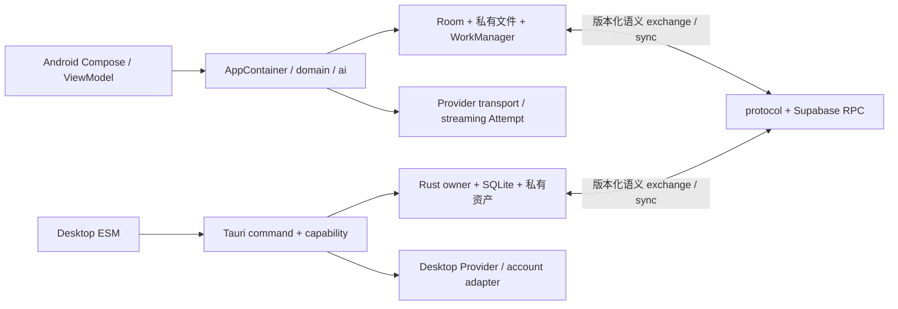

# 南枫 AI 完整开发档案

> **复盘快照：2026-09-18，`HEAD=1580faf50874bf1833b6e581c6a75170a410c6e5`。** 本文依据当前跟踪文件、配置、测试、现行合同与全部本地可达 Git 历史整理；不修改业务代码、配置、schema 或测试。动态设备、服务与发布状态以 [当前交接](CURRENT_HANDOFF.md) 为准。

## 1. 复盘方法、范围与证据等级

| 层级 | 本次核查 | 结论边界 |
| --- | --- | --- |
| 全库身份与结构 | 1,401 个跟踪文件、68,632,395 bytes、173 条可达提交；JSON/XML/Node/Python/Shell 做适用结构检查 | 证明当前跟踪文件身份与部分格式，不是逐行形式证明或二进制视觉验收 |
| 关键语义 | Android 组合根／Room、Desktop ESM→Tauri→Rust、协议 golden、Supabase 迁移、Go 网关、CI 与交付脚本 | 证明所列调用链与配置；不代表线上环境已部署 |
| 自动回归 | Android、Desktop Node/Rust、协议、Supabase 静态测试、Go 测试 | 证明合成／本机边界；不代替主设备、真实 Provider 或 Google 双端同步 |
| 运行外事实 | 不读取私有数据库、凭据、用户正文、忽略构建物或未跟踪预览图 | 未被读取的内容不作推断 |

本次清单与结构审计位于 `release-evidence/2026-09-18-project-retrospective/`：结构审计记录 7 个历史 `docs/evidence/` XML ParseError；它们是既有取证文本，不属于本次业务源码，未被改写掩盖。

## 2. 项目目标与产品边界

南枫 AI 是 Android 与 macOS 的本地优先个人 AI 工作台：管理对话、附件、知识、记忆、项目、导入记录与本机备份；在用户发送时调用已披露 Provider，并可按 Google 身份同步选定对话。项目不把 Android Room 当成 Desktop 数据文件，也不把 Desktop 包当 Windows 交付物。[根 README](../README.md)、[产品简介](product-brief.md)、[P6 Desktop ADR](ADR-002-P6A_DESKTOP_AND_EXCHANGE.md) 是该结论的来源。

- 选择、编辑、预览和本地索引不外发；普通发送才授权该次材料给当前 Provider，实际模型／费用／用量／失败须保留归因。[运行时上下文合同](ANDROID_RUNTIME_CONTEXT_CURRENT_CONTRACT.md)、[Android 执行器](../app/src/main/java/com/nanzhufeng/ai/ai/NormalChatOpenRouterExecutor.kt)。
- 工作区与普通对话复用交互组件，但 CHAT 与 WORK 是独立数据库、独立同步身份和独立恢复范围；跨区只允许用户选中的文本引用。[C-15 合同](C15_WORKSPACE_KNOWLEDGE_PARITY_CONTRACT.md)、[区域 owner](../app/src/main/java/com/nanzhufeng/ai/data/local/ConversationAreaDatabaseOwner.kt)、[Desktop area](../desktop/src-tauri/src/desktop_data_area.rs)。
- 账号同步当前新写入为 Google 登录、HTTPS、账号隔离与 direct 格式；历史加密 envelope 仅作为兼容读取／源设备迁移材料，不得成为日常同步门槛。[P7-F 合同](P7F_SELECTED_CONVERSATION_SYNC_CONTRACT.md)、[最新迁移](../supabase/migrations/202609180007_p8_account_isolated_sync.sql)。

## 3. 技术栈、配置与目录

| 层 | 实际实现 | 主要配置／入口 |
| --- | --- | --- |
| Android | Kotlin、Compose/Material 3、Room、WorkManager、Credentials/Google ID、PDFBox Android；单模块 `:app` | [根 Gradle](../build.gradle.kts)、[app Gradle](../app/build.gradle.kts)、[Manifest](../app/src/main/AndroidManifest.xml) |
| Android 数据 | `NanfengAiDatabase` 当前 Schema 69；CHAT／WORK 使用不同数据库文件，私有附件与后台任务按 area owner 路由 | [数据库](../app/src/main/java/com/nanzhufeng/ai/data/local/NanfengAiDatabase.kt)、[AppContainer](../app/src/main/java/com/nanzhufeng/ai/app/AppContainer.kt) |
| Desktop | 原生 HTML/CSS/ESM + Tauri 2 + Rust 2021 + SQLite/rusqlite；不是 React/Vite 应用 | [package scripts](../desktop/package.json)、[Cargo](../desktop/src-tauri/Cargo.toml)、[Tauri 配置](../desktop/src-tauri/tauri.conf.json) |
| 跨端协议 | JSON v1/v2 exchange、sync 语义 golden 与严格脚本验证；不直接复制平台数据库 | [protocol](../protocol)、[v1 合同](NFAI_EXCHANGE_V1_CONTRACT.md) |
| 云端 | Supabase SQL migration/RPC/RLS、Google 账号；当前远端部署状态不在仓库内 | [migrations](../supabase/migrations)、[同步合同](P7F_SELECTED_CONVERSATION_SYNC_CONTRACT.md) |
| 附件网关 | 独立 Go 服务与 Docker；用于受控上传边界 | [gateway](../upload-gateway/main.go)、[Dockerfile](../upload-gateway/Dockerfile) |

目录职责：`app/` 是 Android 源码、测试与 Room schema；`desktop/` 是 ESM 前端、Tauri/Rust、Node/Rust 测试与桌面构建；`protocol/` 是跨端格式与 golden；`supabase/` 是迁移和头像函数；`upload-gateway/` 是独立 Go 网关；`docs/` 保存现行合同、决策、交接与历史证据；`.agents/skills/` 保存重复开发流程。

## 4. 架构与数据流

### Android

`NanfengAiActivity` 启动 Compose；`ConversationFoundationViewModel` 投影会话状态；`AppContainer` 组装 database、repository、Provider、同步、备份和后台 owner。`data/local` 管 Room 与实体持久化，`domain` 管策略和用例，`ai` 管模型协议／流，`background` 管可续任务。新增业务状态必须进入该链，不能让 UI 形成第二份真相。[Activity](../app/src/main/java/com/nanzhufeng/ai/NanfengAiActivity.kt)、[ViewModel](../app/src/main/java/com/nanzhufeng/ai/ui/ConversationFoundationViewModel.kt)、[Container](../app/src/main/java/com/nanzhufeng/ai/app/AppContainer.kt)。

### Desktop

`desktop/src/app.mjs` 管页面事件与内存投影，`chat-shell.mjs` 管会话 shell，`runtime-chat-commit.mjs` 保持流式更新时的滚动与 DOM 所有权；前端只能通过 Tauri invoke 调用 Rust。`lib.rs` 装配命令和应用状态，模块分别拥有普通聊天、账户同步、备份、提醒、转写、搜索、设置和 area migration。浏览器预览 fixture 不读取生产 SQLite。[前端入口](../desktop/src/app.mjs)、[渲染提交](../desktop/src/runtime-chat-commit.mjs)、[Rust 入口](../desktop/src-tauri/src/lib.rs)。

### 主要业务流

1. **普通对话**：输入草稿 → 本地校验与材料选择 → 创建持久 Attempt → Provider 流事件 → 完整回复／UNKNOWN／失败事务落库 → 标题、费用、来源和 UI 回读。未知结果不自动重发。[Android transport](../app/src/main/java/com/nanzhufeng/ai/ai/OfficialProviderChatTransport.kt)、[Desktop chat owner](../desktop/src-tauri/src/desktop_ordinary_chat_v1.rs)。
2. **工作区**：界面共用 Composer 和消息能力，但 area 决定 database、私有文件、背景任务、cloud document/list 与 restore target；同 ID 也不跨区合并。人工引用只复制选中消息文字和来源版本到目标草稿。[C-15 合同](C15_WORKSPACE_KNOWLEDGE_PARITY_CONTRACT.md)、[引用 bridge](../desktop/src-tauri/src/desktop_manual_area_reference.rs)。
3. **导入／附件／备份**：格式预检 → app-private staging → hash／source identity／occurrence 校验 → 原子提交与 receipt → 重开回读；未知路径或结构拒绝。Android 与 Desktop 保持各自格式 owner，v1/v2 exchange 只在协议边界转换。[P5-D](P5D_LOCAL_BACKUP_RESTORE_DELIVERY_CONTRACT.md)、[P6-K](P6K_CHATGPT_CLAUDE_ZIP_IMPORT_ADOPTION_CONTRACT.md)。
4. **同步**：人工选择对话 → area 绑定的 document identity → 账号范围 RPC / optimistic revision → 回读合并 → 本地 receipt；CHAT 只对 CHAT，WORK 只对 WORK。历史 envelope 仅经可核验源记录迁移。[P7-F](P7F_SELECTED_CONVERSATION_SYNC_CONTRACT.md)、[Android owner](../app/src/main/java/com/nanzhufeng/ai/data/P7FManualConversationSync.kt)、[Desktop owner](../desktop/src-tauri/src/desktop_account_sync_v1.rs)。

## 5. 核心模块

| 模块 | 职责 | 代码与合同依据 |
| --- | --- | --- |
| 会话、消息树、草稿、生命周期 | 创建、分支、归档、回收、恢复、标题与消息操作 | `data/local/RoomConversationRepository.kt`、`ui/ConversationWorkspace.kt`、[会话合同](ANDROID_CONVERSATION_UI_CURRENT_CONTRACT.md) |
| 模型与正常发送 | 多 Provider 目录、路由、材料桥、流、Attempt、费用与失败投影 | `ai/ChatProviderAdapters.kt`、`ai/NormalChatOpenRouterExecutor.kt`、[模型选择](P6G_MODEL_SELECTION_AUTO_ROUTER_CONTRACT.md) |
| 本地数据与附件 | 私有资产、搜索、预览、导入、备份与恢复 | `data/AndroidLocalBackupRestoreManager.kt`、`desktop_local_backup_v1.rs`、[本地数据合同](P2A_LOCAL_DATA_AND_ATTACHMENT_CONTRACT.md) |
| 项目／知识／记忆 | 本地 scope、检索、上下文、版本与关系 | `domain/`、`data/local/`、[C-15](C15_WORKSPACE_KNOWLEDGE_PARITY_CONTRACT.md) |
| 同步与账号 | Google 会话、Supabase RPC、area 文档、receipt、冲突与旧格式兼容 | `data/P7F*`、`desktop_account_sync_v1.rs`、[P7-F](P7F_SELECTED_CONVERSATION_SYNC_CONTRACT.md) |
| Desktop 体验 | chat-first shell、设置、媒体、滚动、原生窗口与通知 | `desktop/src/*.mjs`、`desktop/src-tauri/src/desktop_*`、[Desktop 合同](DESKTOP_CHAT_FIRST_UI_CONTRACT.md) |

## 6. 关键决策与原因

| 决策 | 原因与约束 | 依据 |
| --- | --- | --- |
| 本地优先、发送时才外发 | 附件／正文需要在选择和预览阶段保持本地，调用方与材料必须可追溯 | [运行时合同](ANDROID_RUNTIME_CONTEXT_CURRENT_CONTRACT.md)、[决策日志](decision-log.md) |
| 双端不共享数据库文件 | Room 与 Desktop SQLite 的表、迁移和文件生命周期不同；只共享版本化协议 | [ADR-002](ADR-002-P6A_DESKTOP_AND_EXCHANGE.md)、`protocol/` |
| CHAT/WORK 物理隔离 | UI 相似不应导致消息、草稿、搜索、同步或恢复串区；无项目 WORK 仍属 WORK | [C-15](C15_WORKSPACE_KNOWLEDGE_PARITY_CONTRACT.md)、提交 `1580faf` |
| direct Google 同步 + 旧格式兼容 | 日常同步不应被恢复材料阻塞，同时不删除仍需源设备迁移的旧云记录 | [P7-F](P7F_SELECTED_CONVERSATION_SYNC_CONTRACT.md)、`202609180007_p8_account_isolated_sync.sql` |
| UNKNOWN 保留而非自动重发 | 外部 Provider／网络结果无法确认时，重发可能重复消耗或覆盖事实 | [P3 运行时合同](P3B_RUNTIME_EVENT_STATE_MACHINE_CONTRACT.md)、`desktop_ordinary_chat_v1.rs` |
| 按平台独立正式安装器 | Android、macOS 与未来 Windows 的签名、构建和验收环境不同 | [发布策略](GITHUB_REPOSITORY_AND_RELEASE_POLICY.md)、[Windows 合同](P6D_WINDOWS_NATIVE_DELIVERY_CONTRACT.md) |

## 7. 开发过程与代表性修复

Git 历史共 173 条提交，主要集中于 2026-08-20 至 2026-09-18：初始基线与签名／本地数据，普通聊天与 Provider、导入与媒体恢复，Desktop 工作台与跨端协议，随后是同步、标题、流式滚动、性能和工作区分库。提交主题只能证明代码记录，不能证明实际工时或线上部署。

| 阶段 | 代表记录 | 得到的结论 |
| --- | --- | --- |
| 基线、签名、数据 | `e56d666`、2026-08-20 系列 | 建立 Android 正式签名门、Room/导入/备份合同和独立验收包 |
| 普通聊天与 Provider | `1ded3da`、`d61805c` | 真实聊天须与旧 mock/预览边界区分，Attempt 和流终态持久化 |
| 导入与媒体 | 2026-08-28 多个 `fix` | 文件恢复、引用生命周期、预览与搜索必须围绕真实资产身份处理 |
| Desktop 工作台 | `242ed1e`、`50f4b32` | 前端 shell、Tauri IPC、Rust owner 和 SQLite 要共同验证，浏览器 fixture 不替代原生数据 |
| 同步与标题 | `b11d3a0`、`ff9fd33` | 标题、列表、正文和 receipt 的版本语义应分开；历史同步格式要显式兼容 |
| 独立数据区 | `1580faf` | 旧 `projectId` 过滤不足以满足隔离；需物理数据库、migration、area document identity 与回归一起改变 |

已记录的典型坑与修复：

- PostgreSQL 大密文校验用过大的正则上限会在执行期失败，改为字符集与长度分开验证。[`202609130003_p7g_fix_large_ciphertext_validator.sql`](../supabase/migrations/202609130003_p7g_fix_large_ciphertext_validator.sql)。
- Desktop 流式更新重建 shell 会丢滚动与选择，改为保留 DOM owner 的提交路径并测试迟到读回。[`runtime-chat-commit.mjs`](../desktop/src/runtime-chat-commit.mjs)、[当前交接](CURRENT_HANDOFF.md)。
- 自动标题与普通回答不是同一终态；完整正文不能因标题失败被丢弃，标题重试需受长度与手工标题保护。[`desktop_conversation_title_v1.rs`](../desktop/src-tauri/src/desktop_conversation_title_v1.rs)、[当前交接](CURRENT_HANDOFF.md)。
- 备份合同曾把历史 Schema 37 写成“当前”，当前代码已到 69；合同现改为读取实际打开数据库的 Schema，避免文档反向限制迁移。[P5-D](P5D_LOCAL_BACKUP_RESTORE_DELIVERY_CONTRACT.md)、提交 `1580faf`。

## 8. 测试、验证与交付方式

本次重新运行、且源码仍为 `1580faf` 的自动验证：

| 命令 | 结果 | 能证明什么 |
| --- | --- | --- |
| `:app:testDebugUnitTest :app:lintRelease` | 1,235 tests，0 failures，0 errors，3 skipped；lint 通过 | Android JVM、Room/owner 行为和 Release 静态 lint；不是主设备安装 |
| `npm run test && npm run lint && npm run typecheck && npm run build` | Node 447 pass，0 fail，12 skipped；其余命令通过 | Desktop ESM、静态入口与构建；不是 Tauri 原生行为或真实数据 |
| `cargo test --manifest-path desktop/src-tauri/Cargo.toml` | 301 pass，0 fail，3 ignored | Rust/SQLite owner 行为；ignored 不构成通过 |
| 三个 protocol golden 脚本 | 全部通过 | v1/v2/sync 合成载荷兼容；不是真实账号同步 |
| Supabase Node 静态测试与 `go test -count=1 ./...` | 8 pass；Go 通过 | SQL/头像策略静态约束与网关单测；不是已部署 RPC/RLS/Edge Function |

Android 可安装构建要求完整正式签名配置，Release 使用 v1/v2/v3/v4 签名；Desktop 由 `desktop/scripts/build.mjs` 生成前端静态产物，再由 Tauri macOS bundle 流程封装。正式安装、签名、保数据覆盖、GitHub 附件回读和真实服务均需单独授权与证据，不能由上述测试替代。[app Gradle](../app/build.gradle.kts)、[测试交付 Skill](../.agents/skills/nanfeng-ai-testing-delivery/SKILL.md)。

## 9. 文档冲突与裁决

| 来源 | 冲突／过期断言 | 当前代码或验证 | 裁决 |
| --- | --- | --- | --- |
| 本文旧版本 | 复盘 HEAD 为 `ff9fd33`，Android 版本、目录数量与测试记录停在 9 月 15 日 | 当前 HEAD 为 `1580faf`；`app/build.gradle.kts` 为 1.0.20／84，Room Schema 69 | 已在本档案整体替换；旧事实保留在 Git 历史 |
| `MASTER_DEVELOPMENT_BLUEPRINT.md` 历史段 | 曾把 Schema 63／旧 checkpoint 标成当前 | 数据库注解实际为 version 69，当前状态在 `CURRENT_HANDOFF.md` 顶部 | 历史蓝图不改写；开发时以现行合同、交接和源码优先 |
| 根 README | 公开下载链接仍为 v1.0.12，而本地配置为 1.0.20 | README 描述公开 Release，配置描述本地源码候选；本次未读取 GitHub 远端 | 不是代码矛盾；当前远端发布状态仍待远端回读确认 |
| 旧 E2EE SQL／合同 | 仍存在恢复码和 envelope 逻辑 | 当前迁移 `202609180007` 与 P7-F 规定 direct 新写入、旧格式仅兼容迁移 | 保留迁移历史，不把旧模块当日常同步前置条件 |

## 10. 已知问题与后续路线

1. 当前 Supabase migration、RLS/RPC 与 Edge Function 是否已部署到目标环境，以及真实 Google 账号的双端全量读取／合并。
2. OPPO 保数据覆盖后的首次启动迁移、长代码／表格横滑和完整原生 UI 回放；本仓库禁止以 `connected*AndroidTest` 替代。
3. 最新 1.0.20 Android APK、macOS DMG 是否已作为 GitHub Release 资产上传并可下载校验；README 指向的公开 1.0.12 不证明更高版本已发布。
4. Windows 原生构建、签名、安装与验收；macOS Tauri 包不能替代。
5. 真实 Provider 端到端稳定性、用量／费用账单对账和生产网络故障恢复；本次未读取凭据或发起请求。

后续增量应先选择一个已定义合同和 owner，建立可观察红灯，再补最小实现与同层回归；涉及 area、同步、迁移、签名或真实服务时，应把代码、协议、测试、交接与真实验收分开记录。
